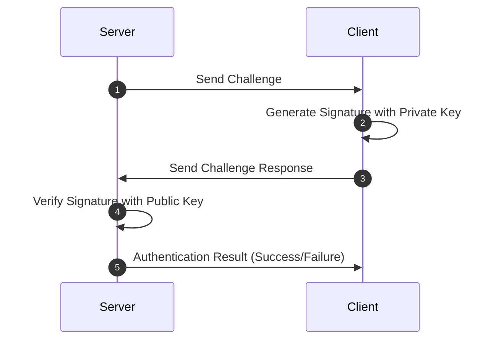

# DDNet
## Decentralized Document Network

---

# Cryptographie

Génération de la pair de clés via phrase mnémonique.

<Crypto />

---
layout: two-cols
---

# WebRTC et Serveur de Signalisation

- WebRTC: Communication entre navigateurs
- Nécessité: Se localiser sur le réseau
- **Serveur de Signalisation**:
    - Échange d'informations pour connexion directe
    - Cesse d'intervenir une fois la connexion établie
    - Utilise WebSocket pour une communication bidirectionnelle

::right::

---
layout: two-cols
---

# Sécurité et Authentification

- Serveur de signalisation: **Pas de données sensibles**
- **Open source**: Peut être autohébergé
- **Module d'authentification**:
    - Vérifie l’authenticité
    - Utilise un mécanisme de poignée de main basé sur défi-réponse
::right::

---

# En-tête du document

Structure de données contenant les informations d'en-tête du document.

<Header />

---

# Chiffrement des Messages : En Bref

- **ECDH** : Crée un secret partagé via les clés de l'expéditeur et du destinataire.
- **PBKDF2** : Dérive une clé AES à partir de ce secret.
- **AES-GCM** : Chiffre le message, garantissant confidentialité et intégrité.
- **ECDSA** : Signature pour certifier l'authenticité de l'expéditeur.

<Encryption />
