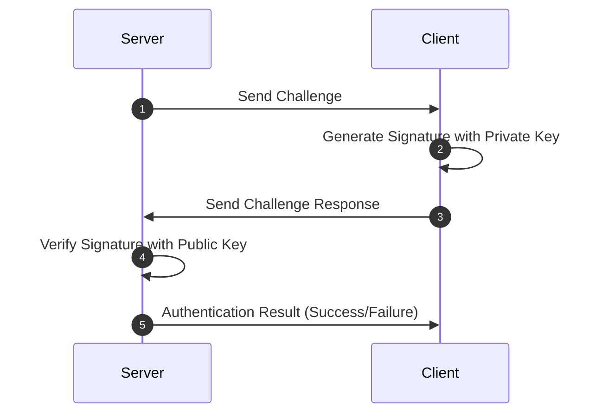

# DDNet
## Decentralized Document Network

---
preload: false
---

# Cryptographie

Génération de la pair de clés via phrase mnémonique.

<Crypto />

---
layout: two-cols
---

# WebRTC et Serveur de Signalisation

- WebRTC: Communication entre navigateurs
- Nécessité: Se localiser sur le réseau
- **Serveur de Signalisation**:
    - Échange d'informations pour connexion directe
    - Cesse d'intervenir une fois la connexion établie
    - Utilise WebSocket pour une communication bidirectionnelle

::right::


---
layout: two-cols
---

# Sécurité et Authentification

- Serveur de signalisation: **Pas de données sensibles**
- **Open source**: Peut être autohébergé
- **Module d'authentification**:
    - Vérifie l’authenticité
    - Utilise un mécanisme de poignée de main basé sur défi-réponse
::right::

<div class="flex flex-col items-center justify-center h-full w-full items-stretch">



</div>

---
preload: false
---

# En-tête du document

Structure de données contenant les informations d'en-tête du document.

<Header />

---
preload: false
---

# Chiffrement des Messages : En Bref

- **ECDH** : Crée un secret partagé via les clés de l'expéditeur et du destinataire.
- **PBKDF2** : Dérive une clé AES à partir de ce secret.
- **AES-GCM** : Chiffre le message, garantissant confidentialité et intégrité.
- **ECDSA** : Signature pour certifier l'authenticité de l'expéditeur.

<Encryption />

---

# Framework Agnostic

DDNet a été conçu pour être **indépendant** de tout framework.

<div class="flex gap-4 items-center justify-center w-full items-stretch">
  <div>
    <h3 class="flex items-center gap-2"><div class="i-logos-react text-4xl"></div>React Hooks</h3>

```ts
import { useState, useEffect } from 'react'
function useDocument<T>(document: Document<T>) {
  const [data, setData] = useState<T>(document.data)
  useEffect(() => {
    const unsub = document.on('change', ({ data }) => {
      setData(data)
    })
    return unsub;
  }, [document])
  return data;
}
```
  </div>
  <div>
    <h3 class="flex items-center gap-2"><div class="i-logos-vue text-4xl"></div>Vue 3 Composition API</h3>

```ts
import { ref, watchEffect } from 'vue'
function useDocument<T>(document: Document<T>) {
  const data = ref<T>(document.data)
  watchEffect((onCleanup) => {
    const unsub = document.on('change', ({ data }) => {
      data.value = data;
    })
    onCleanup(unsub);
  })
  return data;
}
```
  </div>
</div>
